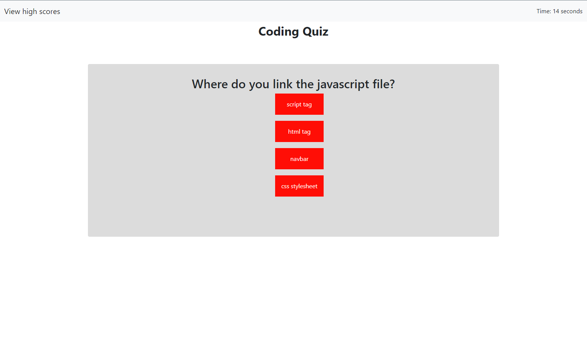

# Coding Quiz

[link to deployed app](https://dariusgarcia.github.io/coding-quiz/)

## Description

This web application allows users to take a timed quiz on different web development topics to help them become better developers.

### Usage

To use this web app, click the start button to begin the quiz where you will have 30 seconds to answer all questions. High scores will be saved so you can view the current high scores.

### Installation

N/A

### Credits

N/A

### License

Please refer to the LICENSE in the repo.
